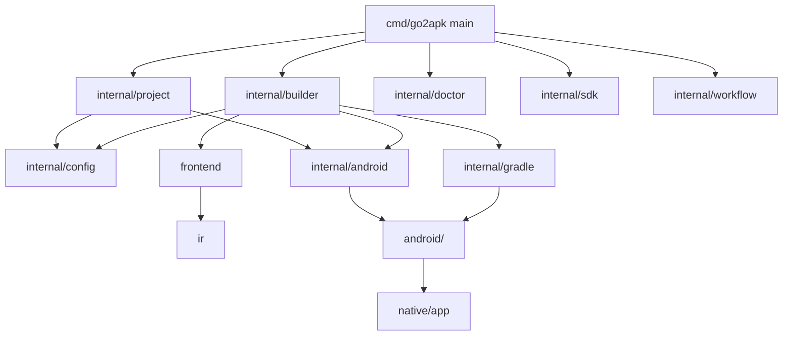
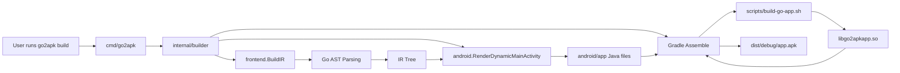

# WORKINGS.md

This file is the living, developer-facing map of Go2APK internals. Keep it synchronized with the implementation whenever code, generated templates, scripts, commands, or project layout change.

## Project Overview

Go2APK is a Go command-line tool that helps turn declarative Go UI applications into Android APKs from scratch without using gomobile. It accomplishes this through an automated AST transpiler, a dynamic Gradle scaffold, and a JNI build pipeline via the Android NDK. 

1. **Primary path:** `go2apk build` parses the user's Go code, constructs an Intermediate Representation (IR) of the UI, and generates a tailored `MainActivity.java`. It then builds a Java shell and a Go-powered JNI library from `native/app`.

The repository is both the CLI source and a self-contained starter project. The checked-in `go2apk.yaml` points to the project config, while the generated `android/` and `native/app/` directories demonstrate the generic Gradle/JNI architecture.

### Main design goals

- **Build from scratch:** Completely avoid `gomobile` dependencies and build Android apps directly via Gradle and NDK.
- **Declarative Go UI:** Users describe their Android application using standard Go code in the `ui` package (e.g., `ui.Button`, `ui.TextView`). The transpiler maps standard inline CSS strings into native Android method calls (like `setBackgroundColor` and `setPadding`) at build time with zero runtime penalty.
- **Native Android APIs:** Direct support for `android.Permission`, `android.Intent`, and `android.BroadcastReceiver` declarations in Go that inject configuration directly into the generated `AndroidManifest.xml` and JNI bindings.
- **Low-friction onboarding:** `go2apk init` writes a complete starter configuration, Android project, helper scripts, and CI workflows.
- **Reproducible Android setup:** SDK installer scripts pin command-line tools, platform, build-tools, and NDK versions.
- **Generated project transparency:** Android templates live in Go source so `init`, AST transformations, and obfuscation updates are deterministic.

### Overall architecture



## Execution Flow

### CLI startup and command dispatch

1. The executable starts in `cmd/go2apk/main.go`.
2. `main()` calls `run(os.Args[1:])`.
3. If no command or a help flag is supplied, `usage()` prints the command list and exits successfully.
4. `run()` captures the current working directory as the project root.
5. The first argument dispatches to one of the internal packages:
   - `init` → `project.Init(root)`
   - `build` → `builder.Build(root, buildOptions(args[1:]))`
   - `preview` → `builder.Preview(root)`
   - `release` → `builder.Release(root, buildOptions(args[1:]))`
   - `clean` → `builder.Clean(root)`
   - `doctor` → `doctor.Check(os.Stdout)`
   - `workflow init` → `workflow.Init(root)`
   - `sdk install` → `sdk.Install(root, os.Stdout)`
6. Any returned error is printed to stderr with the `go2apk:` prefix and exits with status 1.

### Configuration loading

1. Build-like commands call `builder.loadConfig(root)`.
2. `loadConfig` requires `go2apk.yaml` to exist.
3. `config.Load(path)` starts from `config.Default()` values and overwrites recognized simple `key: value` entries.

### `go2apk init`

1. `project.Init` creates the default config.
2. It computes Java package directories from the configured Android package.
3. It prepares a map of generated files: `go2apk.yaml`, Android Gradle files, manifest, Java activity/bridge sources, resources, SDK scripts, and GitHub workflows.
4. For each file, it creates parent directories, skips files that already exist, sets executable mode for shell scripts, and writes missing contents.
5. It scaffolds a default Go UI application in `examples/demo/main.go`.

### `go2apk build`

1. Load configuration and apply build options.
2. Ensure Android project scaffold exists (e.g. `android/app/build.gradle`).
3. Call `frontend.BuildIR(root)` to parse the target Go files and convert the `ui.Run(...)` declarative UI into an `ir.Widget` tree.
4. Pass the IR tree to `android.RenderDynamicMainActivity` to dynamically create the UI in Java.
5. If obfuscation is enabled, rewrite `android/app/build.gradle` and `android/app/proguard-rules.pro` from templates.
6. Create `dist/debug`.
7. Run Gradle task `assembleDebug` from the `android/` directory.
8. If Gradle succeeds, copy files from `android/app/build/outputs/apk/debug` into `dist/debug`.

### `go2apk release`

1. Uses the same frontend parsing as `build`.
2. Runs Gradle tasks `assembleRelease` and `bundleRelease` from the `android/` directory.
3. Copies release artifacts to `dist/release`.

### `go2apk preview`

1. Uses the same frontend parsing as `build` to construct the `ir.Widget` tree.
2. Converts the IR tree into a static HTML/CSS file that mimics the Material Design layout of the Android views.
3. Writes the output to `preview.html` in the project root, skipping Gradle, Java compilation, and NDK builds completely.

### `go2apk doctor` & `go2apk sdk install`
(Remains standard toolchain detection and reproducible SDK downloader.)

## Directory Structure

### `/cmd`

Purpose: contains executable entry points.

### `/internal/android`

Purpose: owns render functions for generated Android project files.

What it contains: template functions for `AndroidManifest.xml`, app `build.gradle`, styles, ProGuard rules, `NativeBridge.java`, and the dynamic `MainActivity.java` renderer.

### `/internal/builder`

Purpose: orchestrates the build process, calling the frontend AST parser, generating dynamic Java code, and running Gradle.

### `/ui`

Purpose: Provides the Go declarative UI framework (e.g. `ui.Run`, `ui.TextView`, `ui.Button`, `ui.LinearLayout`). Users import this to define their app.

### `/frontend`, `/parser`, `/ir`

Purpose: Provides AST parsing of user Go files using the `ui` package, turning them into an Intermediate Representation (`ir.Widget`).

### `/android`

Purpose: the Gradle project scaffold dynamically managed by `go2apk`. It packages the generated `MainActivity.java` and JNI bindings.

### `/native/app`

Purpose: The generic Go code that receives UI events via JNI and routes them to user Go callbacks.

### `/scripts`

Purpose: helper scripts for local Android setup and native builds (`build-go-app.sh`).

## Component Responsibilities

### Frontend AST parsing

`frontend` parses the Go AST of the target program, identifies `ui.Run()`, and extracts widget configurations like text, layout structures, and event listener bindings. This transpilation eliminates the need to manually write Java Android Views.

### Android Code Generation

`internal/android/dynamic_templates.go` takes the `ir.Widget` tree and generates standard Android `View` instantiation, configuration, and layout logic directly inside `MainActivity.java`.

### JNI Native Bridge

Instead of app-specific JNI functions, Go2APK uses a generic `NativeBridge.java` that forwards string-based event IDs (e.g. `button_1_click`) to a shared Go JNI handler (`native/app/jni_android.go`). The Go side then calls the user's Go functions.

## Data Flow

### Build data flow



### Runtime data flow for JNI events

```mermaid
flowchart LR
    Tap[Button tap] --> Activity[MainActivity Event Listener]
    Activity --> Bridge[NativeBridge.sendEventToGo]
    Bridge --> JNI[JNI Export in C/Go]
    JNI --> GoDispatcher[Go Event Router]
    GoDispatcher --> UserFunc[User Go onClick()]
```
