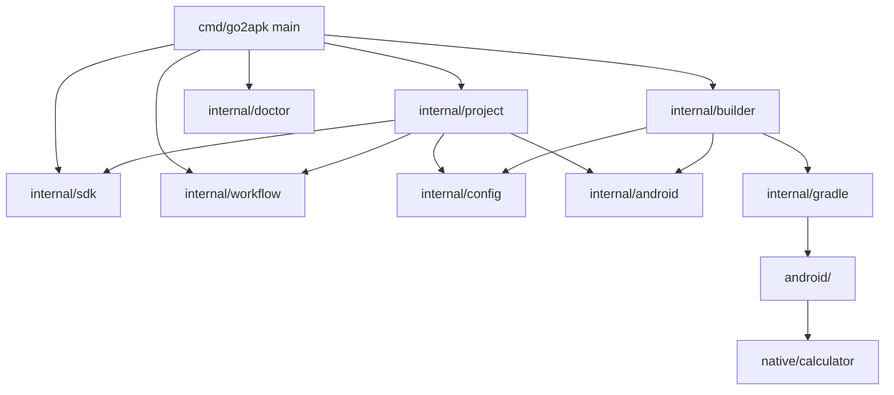
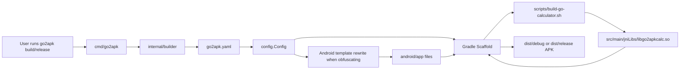
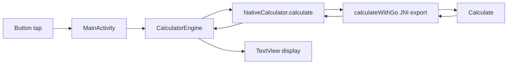
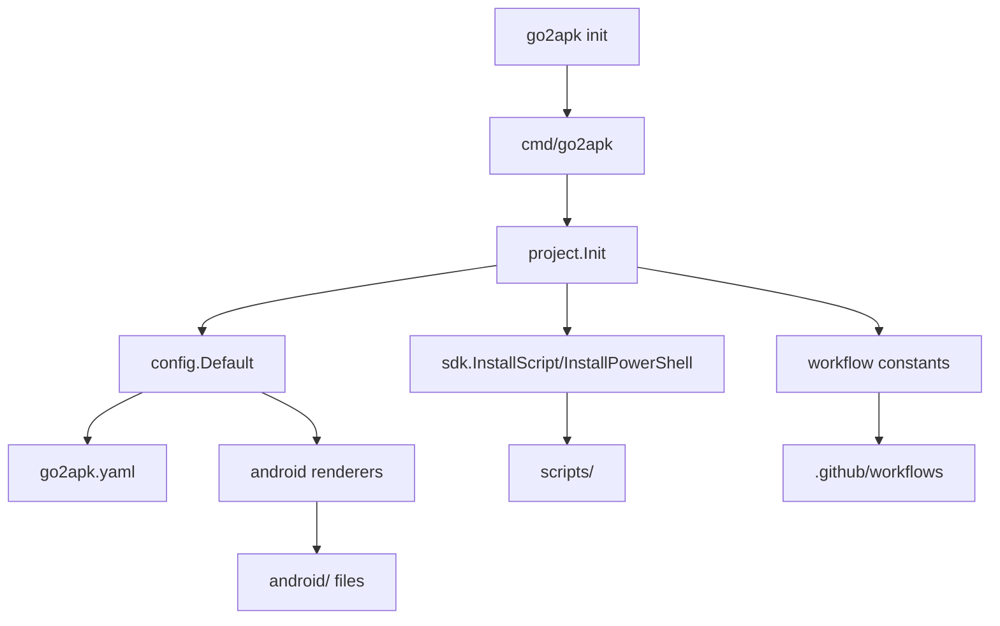

# WORKINGS.md

This file is the living, developer-facing map of Go2APK internals. Keep it synchronized with the implementation whenever code, generated templates, scripts, commands, or project layout change.

## Project Overview

Go2APK is a Go command-line tool that helps turn Go applications into Android APKs from scratch without using gomobile. It accomplishes this through an automated Gradle scaffold and JNI build pipeline via the Android NDK. 

1. **Primary path:** Use a generated Android Gradle project under `android/` that builds a Java shell and a Go-powered JNI library from `native/calculator`.

The repository is both the CLI source and a self-contained starter project. The checked-in `go2apk.yaml` points to the project config, while the checked-in `android/` and `native/` directories demonstrate the Gradle/JNI architecture.

### Main design goals

- **Build from scratch:** Completely avoid `gomobile` dependencies and build Android apps directly via Gradle and NDK.
- **Low-friction onboarding:** `go2apk init` writes a complete starter configuration, Android project, helper scripts, and CI workflows.
- **Minimal runtime dependencies:** Configuration parsing intentionally supports only the simple `key: value` shape generated by the tool, avoiding a YAML library dependency.
- **Reproducible Android setup:** SDK installer scripts pin command-line tools, platform, build-tools, and NDK versions through defaults that can be overridden by environment variables.
- **Generated project transparency:** Android templates live in Go source so `init` and obfuscation updates are deterministic.

### Overall architecture

## Execution Flow

### CLI startup and command dispatch

1. The executable starts in `cmd/go2apk/main.go`.
2. `main()` calls `run(os.Args[1:])`.
3. If no command or a help flag is supplied, `usage()` prints the command list and exits successfully.
4. `run()` captures the current working directory as the project root.
5. The first argument dispatches to one of the internal packages:
   - `init` → `project.Init(root)`
   - `build` → `builder.Build(root, buildOptions(args[1:]))`
   - `release` → `builder.Release(root, buildOptions(args[1:]))`
   - `clean` → `builder.Clean(root)`
   - `doctor` → `doctor.Check(os.Stdout)`
   - `workflow init` → `workflow.Init(root)`
   - `sdk install` → `sdk.Install(root, os.Stdout)`
6. Any returned error is printed to stderr with the `go2apk:` prefix and exits with status 1.

### Configuration loading

1. Build-like commands call `builder.loadConfig(root)`.
2. `loadConfig` requires `go2apk.yaml` to exist.
3. `config.Load(path)` starts from `config.Default()` values and overwrites recognized simple `key: value` entries.
4. `builder.applyOptions` applies CLI flags such as `--obfuscate`, overriding the loaded value when enabled.

### `go2apk init`

1. `project.Init` creates the default config.
2. It computes Java package directories from the configured Android package.
3. It prepares a map of generated files: `go2apk.yaml`, Android Gradle files, manifest, Java activity/bridge sources, resources, SDK scripts, and GitHub workflows.
4. For each file, it creates parent directories, skips files that already exist, sets executable mode for shell scripts, and writes missing contents.
5. It prints `initialized Go2APK project`.

### `go2apk build`

1. Load configuration and apply build options.
2. Require `android/app/build.gradle`; if missing, instruct the user to run `go2apk init`.
3. If obfuscation is enabled, rewrite `android/app/build.gradle` and `android/app/proguard-rules.pro` from templates.
4. Create `dist/debug`.
5. Run Gradle task `assembleDebug` from the `android/` directory.
6. If Gradle fails, return the error immediately so the CLI fails.
7. If Gradle succeeds, copy files from `android/app/build/outputs/apk/debug` into `dist/debug`.

### `go2apk release`

1. Load configuration and apply build options.
2. Require `android/app/build.gradle`; if missing, instruct the user to run `go2apk init`.
3. If obfuscation is enabled, rewrite the Android Gradle and ProGuard files from templates.
4. Create `dist/release`.
5. Run Gradle tasks `assembleRelease` and `bundleRelease` from the `android/` directory.
6. If Gradle fails, return the error immediately.
7. If Gradle succeeds, copy release APK files and release bundle files into `dist/release`.

### `go2apk doctor`

1. `doctor.Check` probes `go`, `java`, `gradle`, `sdkmanager`, and `adb` with `exec.LookPath`.
2. It prints `found:` or `missing:` for each executable.
3. It reports the Android SDK root from `ANDROID_HOME`, `ANDROID_SDK_ROOT`, or a local `.go2apk/android-sdk` directory.
4. It always returns nil; the output is advisory.

### `go2apk sdk install`

1. `sdk.Install` creates `.go2apk/android-sdk` and `scripts/`.
2. It writes `scripts/install-sdk.sh` and `scripts/install-sdk.ps1`.
3. It prints the current OS and SDK path.
4. Running the generated scripts downloads Android command-line tools and installs platform-tools, API 36, build-tools 36.0.0, and NDK 27.2.12479018 unless overridden by environment variables.

### `go2apk workflow init`

1. `workflow.Init` writes `.github/workflows/ci.yml` and `.github/workflows/release.yml` from embedded constants.
2. It creates parent directories as needed.
3. It prints `generated GitHub Actions workflows`.

### Cleanup and shutdown

- `go2apk clean` removes only the generated `dist/` directory.
- There are no long-lived services, goroutines, database connections, or signal handlers. Each command performs synchronous filesystem/process work and exits.

## Directory Structure

### `/cmd`

Purpose: contains executable entry points.

What it contains: `cmd/go2apk/main.go`, the CLI program.

How it is used: Go builds the CLI with `go build ./cmd/go2apk` or runs it with `go run ./cmd/go2apk`.

### `/internal`

Purpose: contains private packages used by the CLI.

Responsibilities: command implementation, configuration parsing, Android template rendering, Gradle orchestration, SDK script generation, workflow generation, and environment diagnostics.

Why it exists: Go's `internal` visibility prevents external modules from importing these implementation packages directly.

### `/internal/android`

Purpose: owns render functions for generated Android project files.

What it contains: template functions for `AndroidManifest.xml`, app `build.gradle`, styles, ProGuard rules, `MainActivity.java`, and `NativeCalculator.java`.

How it is used: `project.Init` writes initial files from these templates; `builder` rewrites Gradle/ProGuard files when obfuscation is requested.

### `/internal/builder`

Purpose: implements build, release, and clean commands.

What it contains: build option handling, config loading, Gradle builds, artifact copying, and `dist/` cleanup.

How it is used: called by `cmd/go2apk` for `build`, `release`, and `clean`.

### `/internal/config`

Purpose: models and loads project configuration.

What it contains: `Config`, default values, and a minimal `go2apk.yaml` parser.

How it is used: `project` uses defaults for generated projects; `builder` uses loaded values to decide names, SDK levels, package names, sources, and obfuscation.

### `/internal/doctor`

Purpose: reports local tooling availability.

What it contains: executable lookup checks and Android SDK root detection.

How it is used: called by `go2apk doctor`.

### `/internal/gradle`

Purpose: selects the Gradle executable.

What it contains: logic that prefers `android/gradlew`, then `android/gradlew.bat`, then system `gradle`.

How it is used: `builder.runGradle` uses it before appending task names.

### `/internal/project`

Purpose: initializes a repository as a Go2APK project.

What it contains: `Init` and config rendering.

How it is used: called by `go2apk init`.

### `/internal/sdk`

Purpose: prepares Android SDK installers.

What it contains: pinned Android tool versions, `Install`, POSIX script template, and PowerShell script template.

How it is used: `go2apk sdk install` writes scripts; `project.Init` embeds the same generated scripts.

### `/internal/workflow`

Purpose: owns GitHub Actions workflow generation.

What it contains: `Init`, `CIYAML`, and `ReleaseYAML` constants.

How it is used: `go2apk workflow init` writes workflows; `project.Init` includes workflows in the generated starter project.

### `/android`

Purpose: checked-in Android Gradle project.

What it contains: root Gradle settings/build file, app module Gradle config, manifest, Java calculator activity and JNI bridge, ProGuard rules, resources, and an assets placeholder.

How it is used: `builder` invokes Gradle from this directory. The app module's `preBuild` depends on `buildGoCalculator`, which calls `scripts/build-go-calculator.sh` to compile native libraries.

### `/native`

Purpose: native Go code for the Gradle JNI app.

What it contains: `native/calculator`, a standalone Go module compiled as `libgo2apkcalc.so` for Android ABIs.

How it is used: the Gradle `buildGoCalculator` task invokes the shell script that cross-compiles this module with the Android NDK.

### `/examples`

Purpose: example Go mobile applications.

What it contains: `examples/demo`, an older Go app.

How it is used: mainly as an additional example.

### `/frontend`, `/parser`, `/ir`

Purpose: Provides experimental frontend architecture for transpiling Go to Java/Android components.

What it contains: Lexer, parser, semantic analyzer, and intermediate representation logic.

How it is used: forms the foundation of future direct Go-to-Java translation without JNI.

### `/scripts`

Purpose: helper scripts for local Android setup and native builds.

What it contains: SDK installers for POSIX/PowerShell and `build-go-calculator.sh` for compiling native calculator shared libraries.

How it is used: users run SDK installers manually; Gradle fallback invokes the native build script automatically.

### `/.github/workflows`

Purpose: CI and release automation.

What it contains: workflows generated from `internal/workflow` constants.

How it is used: CI checks formatting/tests/CLI build and builds a demo debug APK; release workflow builds release artifacts for version tags.

## File Documentation

### `cmd/go2apk/main.go`

Purpose: CLI entry point and command router.

Responsibilities:
- Parse top-level commands and help flags.
- Determine project root from the current working directory.
- Convert `--obfuscate` into `builder.Options`.
- Print errors and usage text.

Public functions/classes: none exported; executable package `main` provides `main()`.

Internal helpers: `run`, `buildOptions`, `usage`.

Depends on: `internal/builder`, `internal/doctor`, `internal/project`, `internal/sdk`, `internal/workflow`, `fmt`, `os`.

Files that depend on it: users and workflows invoke it via `go run ./cmd/go2apk` or built binaries; no Go package imports it.

Notes: command parsing is intentionally simple and does not use a flag framework.

### `internal/config/config.go`

Purpose: represent Go2APK configuration and load the generated config format.

Responsibilities:
- Define `Config` fields used by templates and builders.
- Provide beginner-friendly defaults.
- Parse simple `key: value` lines from `go2apk.yaml`.
- Validate integer and boolean values.

Public functions/classes: `Config`, `Default`, `Load`.

Internal helpers: `atoi`, `atob`.

Depends on: `bufio`, `fmt`, `os`, `strconv`, `strings`.

Files that depend on it: `internal/android/templates.go`, `internal/builder/builder.go`, `internal/project/init.go`, tests in `internal/config`.

Notes: this is not a full YAML parser; nested structures and complex YAML are unsupported.

### `internal/builder/builder.go`

Purpose: orchestrate debug/release builds and artifact cleanup.

Responsibilities:
- Load project config.
- Apply CLI build options.
- Build via Android Gradle scaffold.
- Rewrite obfuscation-sensitive Gradle files when requested.
- Copy APK/AAB artifacts into `dist/`.
- Remove `dist/` on clean.

Public functions/classes: `Options`, `Build`, `Release`, `Clean`.

Internal helpers: `require`, `applyOptions`, `writeObfuscatedGradle`, `runGradle`, `copyArtifacts`, `loadConfig`.

Depends on: `internal/android`, `internal/config`, `internal/gradle`, `fmt`, `os`, `os/exec`, `path/filepath`.

Files that depend on it: `cmd/go2apk/main.go`.

### `internal/gradle/gradle.go`

Purpose: choose how Gradle should be invoked.

Responsibilities:
- Prefer Unix Gradle wrapper at `android/gradlew`.
- Prefer Windows Gradle wrapper at `android/gradlew.bat` if no Unix wrapper exists.
- Fall back to system `gradle`.

Public functions/classes: `Command`.

Internal helpers: none.

Depends on: `os`, `path/filepath`.

Files that depend on it: `internal/builder/builder.go`.

Notes: this package only selects the executable and base args; task names are appended by `builder.runGradle`.

### `internal/android/templates.go`

Purpose: render all generated Android source/config files.

Responsibilities:
- Render the Android manifest from config.
- Render the app module Gradle build file, including release obfuscation flags and JNI library packaging.
- Render the default style resource.
- Render conservative ProGuard rules.
- Render Java JNI bridge code.
- Render Java calculator `MainActivity` and its embedded calculator engine.

Public functions/classes: `RenderManifest`, `RenderBuildGradle`, `RenderStyles`, `RenderProguardRules`, `RenderNativeCalculator`, `RenderMainActivity`.

Internal helpers: Java methods embedded in generated source, including UI creation, display refresh, input handling, and `CalculatorEngine` operations.

Depends on: `internal/config`, `fmt`.

Files that depend on it: `internal/project/init.go`, `internal/builder/builder.go`, tests in `internal/android`.

Notes: the generated Gradle file registers `buildGoCalculator` and wires it into `preBuild`.

### `internal/project/init.go`

Purpose: create the initial Go2APK project skeleton.

Responsibilities:
- Load default config.
- Compute Java file paths from Android package names.
- Generate config, Android, script, and workflow files.
- Avoid overwriting existing files.
- Apply executable permissions to shell scripts.

Public functions/classes: `Init`.

Internal helpers: `renderConfig`.

Depends on: `internal/android`, `internal/config`, `internal/sdk`, `internal/workflow`, `fmt`, `os`, `path/filepath`, `strings`.

Files that depend on it: `cmd/go2apk/main.go`.

Notes: generated Java package paths follow the default package unless users edit config/templates afterward.

### `internal/sdk/sdk.go`

Purpose: generate reproducible Android SDK installer scripts.

Responsibilities:
- Define default Android command-line tools, build-tools, platform, and NDK versions.
- Create `.go2apk/android-sdk` and `scripts/` directories.
- Write POSIX and PowerShell installer scripts.
- Let environment variables override pinned defaults when scripts run.

Public functions/classes: `Install`, `InstallScript`, `InstallPowerShell`.

Internal helpers: package constants for versions.

Depends on: `fmt`, `io`, `os`, `path/filepath`, `runtime`.

Files that depend on it: `cmd/go2apk/main.go`, `internal/project/init.go`.

Notes: `Install` prepares scripts and directories; it does not itself download Android SDK packages.

### `internal/workflow/workflow.go`

Purpose: generate GitHub Actions workflows.

Responsibilities:
- Write CI and release workflow files.
- Store canonical workflow YAML strings.
- Create workflow directories as needed.

Public functions/classes: `Init`, `CIYAML`, `ReleaseYAML`.

Internal helpers: none.

Depends on: `fmt`, `os`, `path/filepath`.

Files that depend on it: `cmd/go2apk/main.go`, `internal/project/init.go`.

Notes: CI uses Go, Java, Android SDK setup, and demo APK artifact upload.

### `internal/doctor/doctor.go`

Purpose: inspect local development/build prerequisites.

Responsibilities:
- Report availability of Go, Java, Gradle, sdkmanager, and adb.
- Detect Android SDK root from environment or local `.go2apk/android-sdk`.
- Write human-readable diagnostics to an `io.Writer`.

Public functions/classes: `Check`.

Internal helpers: `androidSDKRoot`.

Depends on: `fmt`, `io`, `os`, `os/exec`, `path/filepath`.

Files that depend on it: `cmd/go2apk/main.go`.

Notes: missing tools are reported in output rather than returned as errors.

### `native/calculator/calculator.go`

Purpose: implement calculator arithmetic for the Gradle JNI app.

Responsibilities:
- Parse decimal operands.
- Apply addition, subtraction, multiplication, division, and remainder.
- Handle divide-by-zero and integer-only remainder messages.
- Format display-safe decimal strings.

Public functions/classes: `Calculate`.

Internal helpers: `parseDecimal`, `integerValue`, `formatDecimal`, `main`.

Depends on: `errors`, `math/big`, `strings`.

Files that depend on it: `native/calculator/jni_android.go`, tests in `native/calculator`, and Android fallback UI through JNI.

Notes: package is `main` because it is compiled as a c-shared Android library.

### `native/calculator/jni_android.go`

Purpose: expose calculator arithmetic to Android Java through JNI.

Responsibilities:
- Export `Java_com_example_go2apkapp_NativeCalculator_calculateWithGo` for Android+cgo builds.
- Convert Java strings to Go strings.
- Convert Go results back to Java strings.
- Convert `Calculate` errors to displayable result text.

Public functions/classes: exported JNI symbol `Java_com_example_go2apkapp_NativeCalculator_calculateWithGo`.

Internal helpers: `javaString`, `newJavaString`, C helper functions for JNI string operations.

Depends on: `Calculate`, cgo, `jni.h`, `stdlib.h`, `unsafe`.

Files that depend on it: generated/checked-in `NativeCalculator.java` loads `libgo2apkcalc` and calls the native method.

Notes: the JNI symbol currently encodes the default Java package `com.example.go2apkapp`.

### `scripts/build-go-calculator.sh`

Purpose: compile the Go calculator JNI library for Android ABIs.

Responsibilities:
- Locate the repository root, Android app directory, native calculator module, output directory, API level, and NDK.
- Resolve NDK from `ANDROID_NDK_HOME`, `ANDROID_NDK_ROOT`, or the latest installed NDK under the SDK root.
- Select the host toolchain tag.
- Build `libgo2apkcalc.so` for `arm64-v8a`, `armeabi-v7a`, `x86`, and `x86_64`.

Public functions/classes: shell function `build_abi`.

Internal helpers: environment-variable defaults and host tag detection.

Depends on: Bash, Go, Android NDK clang toolchains.

Files that depend on it: generated app Gradle task `buildGoCalculator`.

Notes: exits non-zero with setup guidance when no NDK is found.

### `go2apk.yaml`

Purpose: default project configuration consumed by build/release commands.

Responsibilities:
- Store app name, package, version, Android SDK levels, orientation, theme, Go source path, and obfuscation preference.

Public functions/classes: not code.

Internal helpers: not applicable.

Depends on: parsed by `internal/config.Load`.

Files that depend on it: `internal/builder.loadConfig`, Android template rendering.

Notes: values are simple scalar `key: value` entries.

### `go.mod`

Purpose: root Go module definition.

Responsibilities:
- Declares module path `github.com/Baba01hacker666/Go2APK` and Go version.

Public functions/classes: not code.

Internal helpers: not applicable.

Depends on: Go toolchain.

Files that depend on it: all root module Go packages and CI setup-go configuration.

Notes: the demo and native calculator each have their own module files.

## Component Responsibilities

### Configuration

Configuration lives in `go2apk.yaml` and is represented by `config.Config`. It exists to decouple app metadata and build settings from code. `project.Init` generates the file, `builder` loads it, and `android` templates render from it.

### CLI/API surface

The public user interface is the `go2apk` CLI. There is no HTTP API, database API, or library API intended for external consumers. Commands are thin wrappers over internal packages.

### Build orchestration

`internal/builder` owns the build lifecycle. It delegates to Gradle through `internal/gradle` and the generated Android project. It also owns output placement under `dist/`.

### Android generation

`internal/android` contains deterministic render functions for generated Android files. `internal/project` uses them for initial scaffolding, and `internal/builder` reuses them when Gradle obfuscation settings need to reflect CLI/config choices.

### Gradle Scaffold

The checked-in/generated Android project provides the APK build path. Its app module builds Java UI code and packages JNI libraries from `src/main/jniLibs`. The `buildGoCalculator` Gradle task invokes `scripts/build-go-calculator.sh` before Android prebuild.

### Native calculator/JNI

`native/calculator` contains Go arithmetic and Android JNI glue. The shell script cross-compiles it into `libgo2apkcalc.so`; Java `NativeCalculator` loads that library; `MainActivity.CalculatorEngine` uses the Java bridge to compute results.

### SDK setup

`internal/sdk` writes installer scripts, and those scripts perform downloads/installations when run by a user or CI. This separates generation from networked SDK installation.

### Workflow automation

`internal/workflow` stores CI/release YAML. The workflows validate Go formatting/tests/builds and exercise Android demo artifact generation in CI environments.

### Logging/diagnostics

There is no logging subsystem. Commands write user-facing status to stdout and errors/fallback notices to stderr. `doctor.Check` writes diagnostic lines to an injected writer for easy testing.

### Database, cache, authentication, scheduler, workers, background jobs, storage, networking

These subsystems do not exist in the current implementation. The project performs local filesystem operations, invokes external processes, and only performs network access indirectly when generated SDK scripts or GitHub Actions install Android tooling.

## Data Flow

### Build data flow

### Runtime data flow for Gradle JNI calculator

### Initialization data flow

## Keeping This Document Current

When changing this repository:

- Update this document in the same commit as implementation changes.
- Add, rename, or remove directory and file documentation entries as the project layout changes.
- Update execution flow whenever command behavior, fallback behavior, generated files, or cleanup semantics change.
- Update component responsibilities whenever a subsystem is added, removed, or materially changed.
- Update Mermaid diagrams when data movement changes.
- Treat mismatches between this file and code as bugs.
